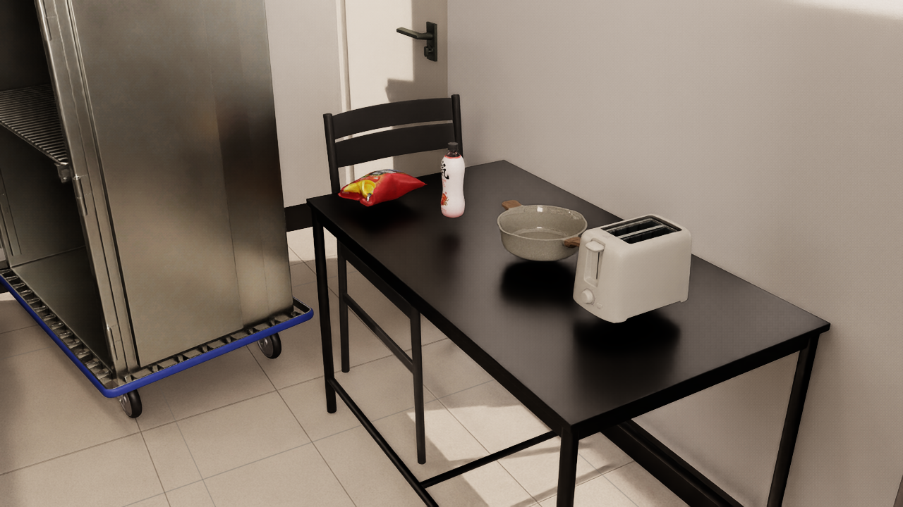
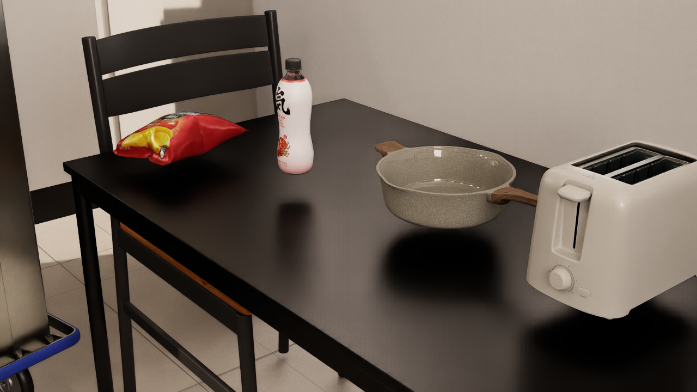

# Room_Mesh 与五件 Lightwheel 资产复现

这是一个面向 NVIDIA Isaac Sim 6.0.0.1 的组合场景。原始
`Room_Mesh/Scene.usd` 保持不变，新增的 `Room_With_Lightwheel.usda` 通过
USD sublayer 引用完整房间，并加入以下五件 Lightwheel 资产：

- `BaggedFood020`
- `BottledDrink034`
- `Pot079`
- `Toaster099`
- `Cart018`





四件小物品放在厨房餐桌上，推车放在餐桌左侧地面。为了避免重叠，组合层
只停用了原餐桌上的 `CoffeeMachine094`；源场景没有被修改。

## 仓库可见性

`Room_Mesh.zip` 内没有许可证或来源说明，因此本仓库和包含原场景数据的
Release 保持为 private。确认 Room_Mesh 的公开再分发授权前，不应把 Release
改为 public。Lightwheel 五件资产使用 CC BY-NC 4.0，仅限非商业用途。

## 环境要求

- Ubuntu 22.04 x86_64
- 支持 Vulkan 的 NVIDIA GPU，建议至少 16 GiB 显存
- Python 3.12 与 `venv`
- GitHub CLI、unzip 和 zstd：`sudo apt install gh unzip zstd`
- 至少 40 GiB 可用空间

## 一键复现

先用有权访问本私有仓库的 GitHub 账号登录：

```bash
gh auth login
gh repo clone vigorlee/lightwheel-room-mesh-isaacsim-repro
cd lightwheel-room-mesh-isaacsim-repro
./scripts/download_assets.sh
./scripts/install_isaacsim.sh
export OMNI_KIT_ACCEPT_EULA=YES  # 阅读并接受 NVIDIA EULA 后设置
./start_room_mesh.sh
```

已经安装 Isaac Sim 6.0.0.1 时可跳过安装：

```bash
export OMNI_KIT_ACCEPT_EULA=YES
ISAACSIM_PYTHON=/你的/isaacsim/python ./start_room_mesh.sh
```

## 截图和验证

```bash
python3 scripts/verify_package.py

export OMNI_KIT_ACCEPT_EULA=YES
./start_room_mesh.sh --headless --camera overview \
  --screenshot room-overview.png --exit-after 1
./start_room_mesh.sh --headless --camera detail \
  --screenshot room-detail.png --exit-after 1
```

本机验证结果：Room_Mesh 原包 CRC 全部通过；源 Stage 和组合 Stage 的 USD
composition errors 均为 0；组合 Stage 包含 3615 个源场景 Prim 和 5 件新资产；
RTX 两张截图均为 1280 x 720、非黑帧，材质和灯光正常。五件资产的刚体与
碰撞体均可解析，Cart018 的 8 个关节和 Toaster099 的 4 个关节没有失效引用。

## 数据大小与校验

原始 Room_Mesh 压缩包为 2,454,033,960 字节，解压后约 4.4 GiB。由于超过
GitHub 单个 Release 附件 2 GiB 的上限，v1.0.0 分为 1,572,864,000 字节和
881,169,960 字节两个分卷；下载脚本会自动合并并核对原始 ZIP SHA-256：

```text
0be5acc7fe75d1982decd9c4f934c79e32b8c183cfc3928bd1d5b82819e1babc
```

主入口：

```text
assets/Room_Mesh/Room_With_Lightwheel.usda
```

详细来源与授权边界见 [THIRD_PARTY_NOTICES.md](THIRD_PARTY_NOTICES.md)。
